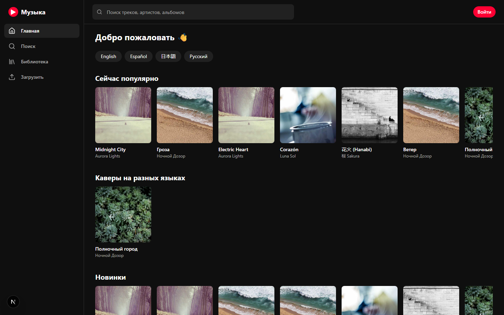
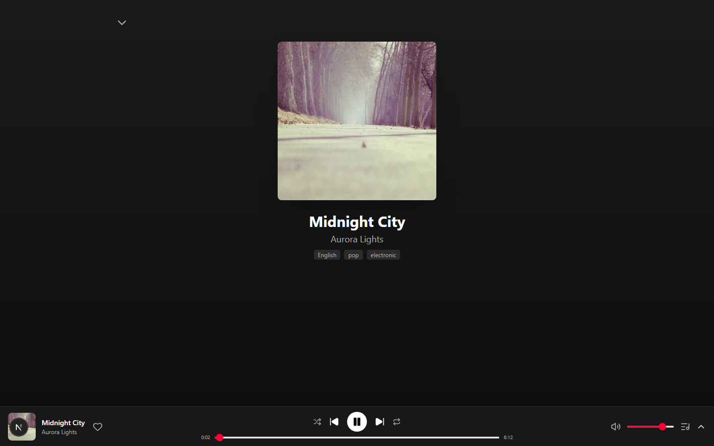
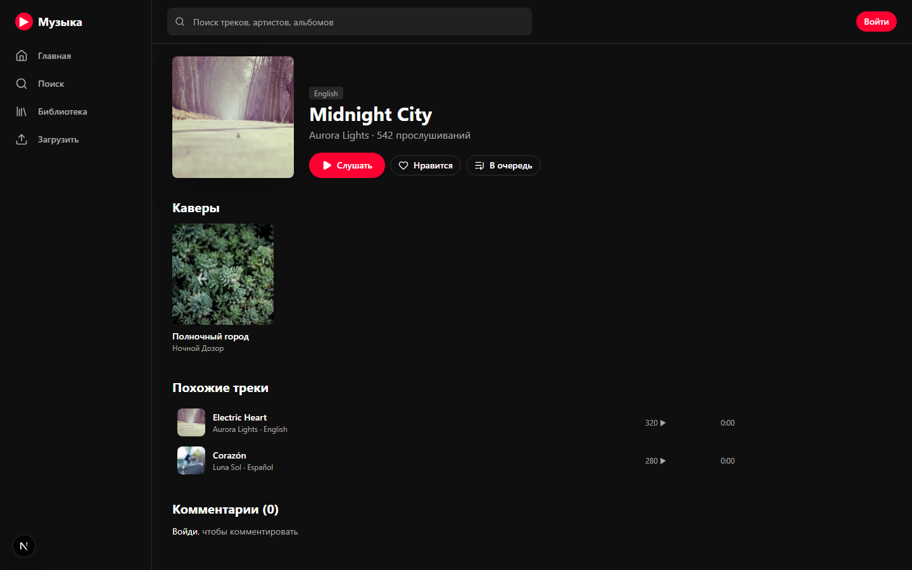
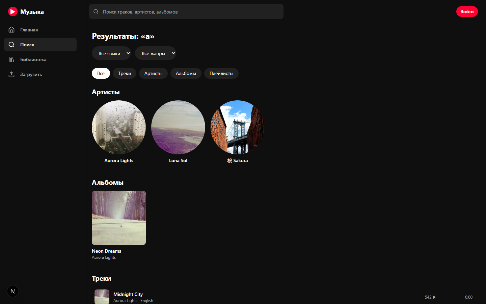
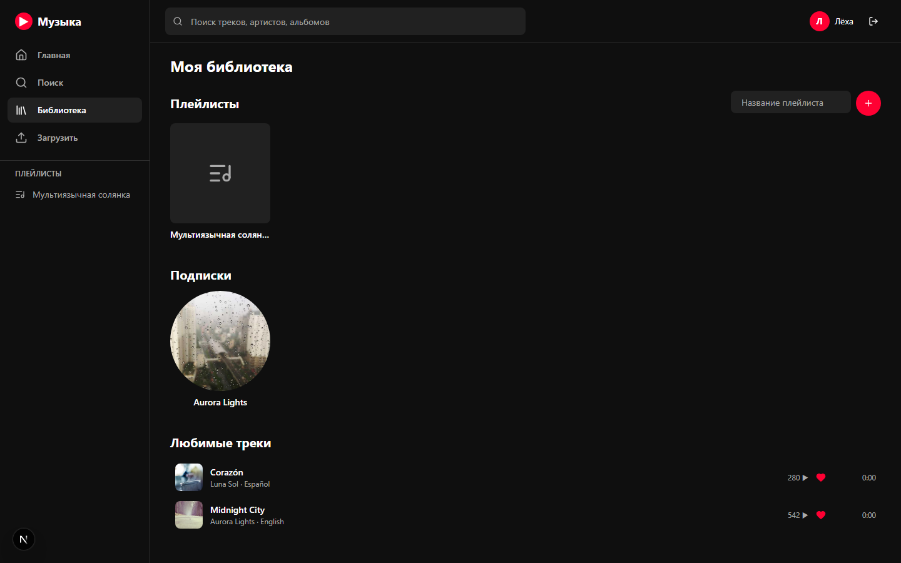
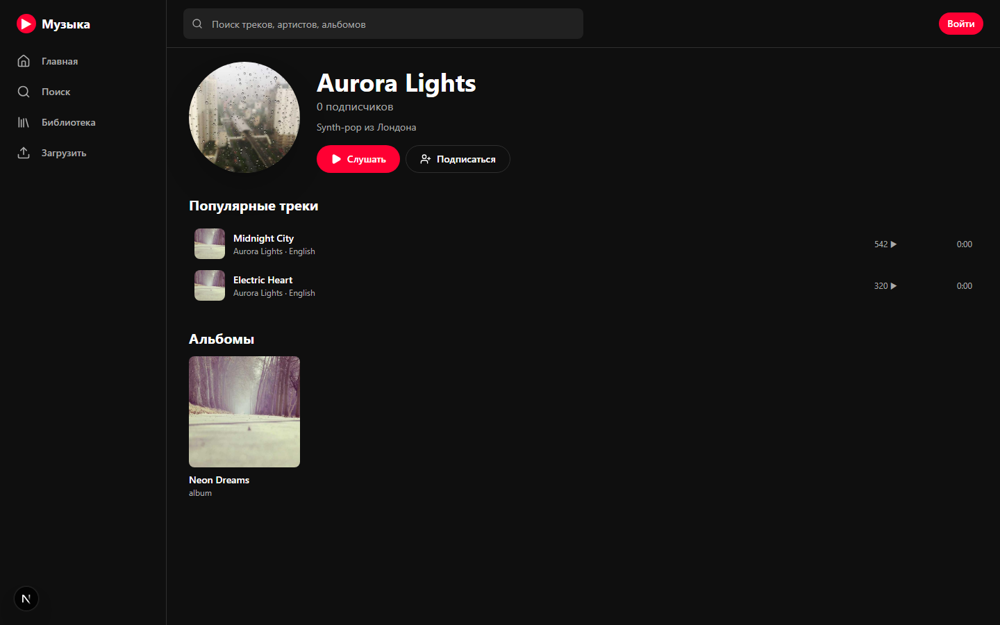
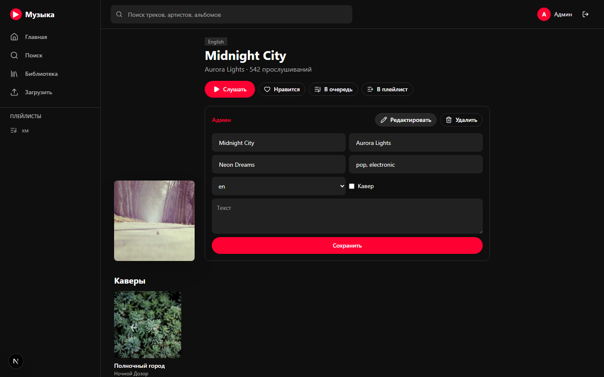

# 🎵 Music Platform — стриминг в стиле YouTube Music

Полноценная музыкальная платформа: аккаунты, плеер с очередью, плейлисты, библиотека,
альбомы, артисты, умный поиск, многоязычный контент, каверы и админ-панель.



## Стек

**Backend** (`/server`): NestJS 11 · Mongoose 9 · MongoDB · JWT (access + refresh) ·
Passport · class-validator · Swagger.

**Frontend** (`/client`): Next.js 16 (App Router) · React 19 · Redux Toolkit ·
TanStack Query 5 · Tailwind CSS 4 · lucide-react · sonner.

Монорепо на **pnpm workspaces**.

## Возможности

- 🔐 **Аккаунты** — регистрация/вход (JWT, авто-refresh токена), роли `user` / `admin`
- ▶️ **Плеер** — очередь, next/prev, перемешивание, повтор (off/one/all), громкость,
  перемотка, мини-бар + полноэкранный режим с текстом песни
- 📚 **Библиотека** — лайки, плейлисты (CRUD), подписки на артистов
- 💿 **Артисты и альбомы** — страницы с топ-треками и альбомами, подписки
- 🔎 **Поиск** — по трекам/артистам/альбомам/плейлистам; **по жанру и по исполнителю**;
  фильтры по языку и жанру; браузинг треков по жанру/языку без запроса
- 🌍 **Многоязычность** (фильтр по языку) и **каверы** (связь кавера с оригиналом)
- 🛠 **Админка** — админ может редактировать любой трек (сменить исполнителя, засунуть в
  альбом / вынуть, поменять жанры, язык, текст, флаг «кавер») и удалять; обычный юзер
  удаляет только свои загрузки
- 🏠 **Главная** — подборки: популярное, новинки, каверы на разных языках, история

## Скриншоты

| Полноэкранный плеер | Страница трека |
|---|---|
|  |  |

| Поиск с фильтрами | Библиотека |
|---|---|
|  |  |

| Страница артиста | Админ-редактирование трека |
|---|---|
|  |  |

## Требования

- Node.js 20+ (проверено на 24)
- MongoDB: Atlas или локальный инстанс
- **pnpm** 10+ (`corepack enable pnpm` или `npm i -g pnpm`)

## Запуск

### 1. Установка (из корня — ставит оба пакета сразу)

```bash
pnpm install
```

### 2. Переменные окружения

```bash
cp server/.env.example server/.env          # заполни MONGO_URI и JWT-секреты
cp client/.env.example client/.env.local    # NEXT_PUBLIC_API_URL=http://localhost:5000
```

`server/.env`:
```
PORT=5000
MONGO_URI=mongodb+srv://<user>:<pass>@<cluster>.mongodb.net/music
JWT_ACCESS_SECRET=...       # node -e "console.log(require('crypto').randomBytes(48).toString('hex'))"
JWT_REFRESH_SECRET=...
CLIENT_URL=http://localhost:3000
# DNS_SERVERS=8.8.8.8,1.1.1.1   # только если в твоей сети Node не резолвит mongodb+srv
```

### 3. Запуск (одна команда — бэк + фронт)

```bash
pnpm build        # один раз: соберёт server (нужно для seed)
pnpm seed         # (опционально) демо-данные с royalty-free аудио и обложками
pnpm dev          # ▶ поднимает И бэк (:5000, Swagger /api/docs), И фронт (:3000)
```

Только один из сервисов:
```bash
pnpm dev:server   # только NestJS
pnpm dev:client   # только Next.js
```

### Демо-аккаунты (после `pnpm seed`)

| Роль | Email | Пароль |
|------|-------|--------|
| Пользователь | `demo@demo.dev` | `demo1234` |
| Админ | `admin@demo.dev` | `admin1234` |

## Полезные скрипты (из корня)

| Команда | Что делает |
|---------|-----------|
| `pnpm dev` | поднимает бэк и фронт параллельно (один Ctrl+C гасит оба) |
| `pnpm build` | собирает оба пакета |
| `pnpm seed` | демо-данные: 4 артиста, 7 треков на разных языках + кавер, плейлист, 2 юзера. Аудио — [SoundHelix](https://www.soundhelix.com) (royalty-free), картинки — [Picsum](https://picsum.photos) |
| `pnpm smoke` | end-to-end смоук-тест API на in-memory MongoDB (не трогает боевую БД) |

## API (Swagger)

После запуска бэка — интерактивная документация на `http://localhost:5000/api/docs`.
Основные группы: `auth`, `users`, `tracks`, `artists`, `albums`, `playlists`, `search`, `home`.

## Безопасность

- Все секреты — в `.env` (в git **не** коммитятся).
- Загрузка/правка/удаление треков под JWT; редактирование чужих треков — только `admin`.

## Структура

```
server/src/
  auth/      — регистрация, вход, JWT, guards (JwtAuthGuard, RolesGuard)
  user/      — лайки, подписки, библиотека
  artist/ album/ playlist/ track/   — домены
  search/ home/                     — поиск и лента
  file/      — загрузка/удаление файлов
  common/    — декораторы (@CurrentUser, @Roles)
client/
  app/       — маршруты (App Router): /, /search, /library, /upload, /track/[id], ...
  components/ — плеер, оболочка, карточки, ui, админ-панель
  store/     — Redux Toolkit (auth / player / queue)
  hooks/     — TanStack Query + хелперы плеера
```
